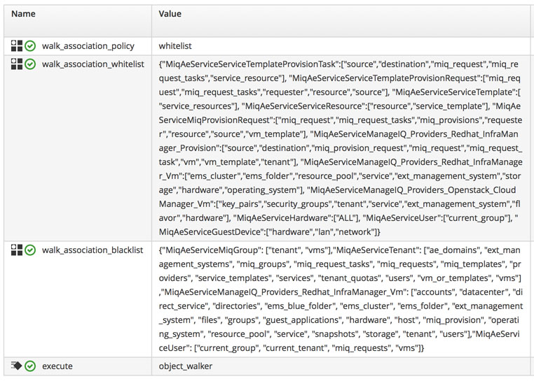
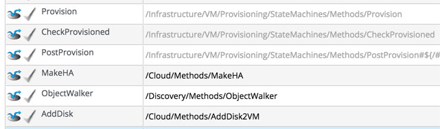
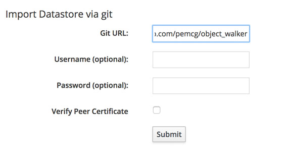
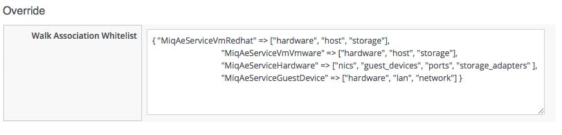
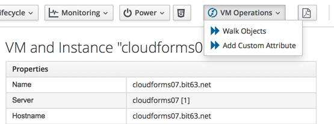

# object_walker

One of the challenges when starting out writing CloudForms or ManageIQ automation scripts, is knowing where the objects and attributes are under `$evm.root` that we may need to access. For example, depending on the automation action, we may have an `$evm.root['vm']` object, or we may not.

This script is an attempt to demystify the object structure that is available at any point in an Automation workflow.

Calling the script from any point will walk the object hierarchy from `$evm.root` downwards, printing objects and attributes
as it goes, i.e.


```
Object Walker 1.8 Starting
     --- walk_association_policy details ---
     walk_association_policy = whitelist
     walk_association_whitelist = { 'MiqAeServiceMiqProvisionRequest': ['miq_request','miq_request_tasks','miq_provisions','requester','resource','source','vm_template'], 'MiqAeServiceManageIQ_Providers_Redhat_InfraManager_Provision': ['source','destination','miq_provision_request','miq_request','miq_request_task','vm','vm_template','tenant'], 'MiqAeServiceManageIQ_Providers_Redhat_InfraManager_Vm': ['ems_cluster','ems_folder','resource_pool','service','ext_management_system','storage','hardware','operating_system'], 'MiqAeServiceHardware': ['nics','guest_devices','ports','vm'], 'MiqAeServiceUser': ['current_group'], 'MiqAeServiceGuestDevice': ['hardware','lan','network'] }
     --- $evm.current_* details ---
     $evm.current_namespace = Bit63/Stuff   (type: String)
     $evm.current_class = ObjectWalker   (type: String)
     $evm.current_instance = object_walker   (type: String)
     $evm.current_method = object_walker   (type: String)
     $evm.current_message = create   (type: String)
     $evm.current_object = /Bit63/Stuff/ObjectWalker/object_walker   (type: DRb::DRbObject, URI: druby://127.0.0.1:33776)
     $evm.current_object.current_field_name = execute   (type: String)
     $evm.current_object.current_field_type = method   (type: String)
     --- automation instance hierarchy ---
     /ManageIQ/System/Process/AUTOMATION  ($evm.root)
     |    /ManageIQ/infrastructure/VM/Lifecycle/Provisioning
     |    |    /ManageIQ/Infrastructure/VM/Provisioning/Profile/EvmGroup-super_administrator
     |    |    /Bit63/Infrastructure/VM/Provisioning/StateMachines/VMProvision_vm/template  ($evm.parent)
     |    |    |    /ManageIQ/Infrastructure/VM/Provisioning/StateMachines/Methods/CustomizeRequest
     |    |    |    /ManageIQ/Infrastructure/VM/Provisioning/Placement/default
     |    |    |    /Bit63/Stuff/ObjectWalker/object_walker  ($evm.object)
     --- walking $evm.root ---
     $evm.root = /ManageIQ/System/Process/AUTOMATION   (type: DRb::DRbObject, URI: druby://127.0.0.1:33776)
     |    --- attributes follow ---
     |    $evm.root['ae_next_state'] =    (type: String)
     |    $evm.root['ae_provider_category'] = infrastructure   (type: String)
     |    $evm.root['ae_result'] = ok   (type: String)
     |    $evm.root['ae_state'] = WalkObjects   (type: String)
     |    $evm.root['ae_state_retries'] = 0   (type: Fixnum)
     |    $evm.root['ae_state_started'] = 2016-08-01 09:55:59 UTC   (type: String)
     |    $evm.root['ae_state_step'] = main   (type: String)
     |    $evm.root['ae_status_state'] = on_exit   (type: String)
     |    $evm.root['miq_group'] => #<MiqAeMethodService::MiqAeServiceMiqGroup:0x0000000c6728c8>   (type: DRb::DRbObject, URI: druby://127.0.0.1:33776)
     |    |    --- attributes follow ---
     |    |    $evm.root['miq_group'].created_on = 2016-05-25 08:09:35 UTC   (type: ActiveSupport::TimeWithZone)
     |    |    $evm.root['miq_group'].description = EvmGroup-super_administrator   (type: String)
     |    |    $evm.root['miq_group'].filters = nil
     |    |    $evm.root['miq_group'].group_type = system   (type: String)
     |    |    $evm.root['miq_group'].id = 2   (type: Fixnum)
     |    |    $evm.root['miq_group'].sequence = 1   (type: Fixnum)
     |    |    $evm.root['miq_group'].settings = nil
     |    |    $evm.root['miq_group'].tenant_id = 1   (type: Fixnum)
     |    |    $evm.root['miq_group'].updated_on = 2016-05-25 08:09:35 UTC   (type: ActiveSupport::TimeWithZone)
     |    |    --- end of attributes ---
     |    |    --- virtual columns follow ---
     |    |    $evm.root['miq_group'].allocated_memory = 1073741824   (type: Fixnum)
     |    |    $evm.root['miq_group'].allocated_storage = 42949672960   (type: Fixnum)
     |    |    $evm.root['miq_group'].allocated_vcpu = 1   (type: Fixnum)
```
  etc.


Several of the objects in the Automate model have circular references to themselves either directly or indirectly through
other associations. To prevent the same object being printed multiple times the script records where it's been, and prints:

```
    |    (object type: MiqAeServiceManageIQ_Providers_Openstack_CloudManager_Vm, object ID: 23)
    |    |    Object MiqAeServiceManageIQ_Providers_Openstack_CloudManager_Vm with ID 23 has already been printed...
```

## Configuration Instance - NEW!

object_walker 2.0 comes with a new _configuration_ instance containing the configuration attributes. The configuration instance **must** be called _/Discovery/ObjectWalker/configuration_.

> **Note**
> 
> For backwards compatibility and for invoking _object\_walker_ via `$evm.instantiate` or from an instance relationship, the _object\_walker_ instance still remains, however this no longer contains the configuration attributes.

### print\_evm\_object 

print\_evm\_object can be used to toggle whether or not to walk the object structure of the `$evm.object` (i.e current) object. If object\_walker has been invoked from `$evm.instantiate` or from a relationship then `$evm.object` will be object\_walker itself. If object\_walker has been invoked from an embedded method then $evm.object is the calling method's instance.

### print\_evm\_parent

print\_evm\_parent can be used to toggle whether or not to walk the object structure of the `$evm.parent` object. If object\_walker has been invoked from `$evm.instantiate` or from a relationship then `$evm.parent` will be the calling instance.

### print\_nil\_values

Many attributes that get printed have a value of 'nil', i.e.

```
     |    |    $evm.root['user'].userid = admin   (type: String)
     |    |    --- end of attributes ---
     |    |    --- virtual columns follow ---
     |    |    $evm.root['user'].allocated_memory = 0   (type: Fixnum)
     |    |    $evm.root['user'].allocated_storage = 0   (type: Fixnum)
     |    |    $evm.root['user'].allocated_vcpu = 0   (type: Fixnum)
     |    |    $evm.root['user'].custom_1 = nil
     |    |    $evm.root['user'].custom_2 = nil
     |    |    $evm.root['user'].custom_3 = nil
     |    |    $evm.root['user'].custom_4 = nil
     |    |    $evm.root['user'].custom_5 = nil
     |    |    $evm.root['user'].custom_6 = nil
     |    |    $evm.root['user'].custom_7 = nil
     |    |    $evm.root['user'].custom_8 = nil
     |    |    $evm.root['user'].custom_9 = nil
     |    |    $evm.root['user'].ldap_group = EvmGroup-super_administrator   (type: String)
     |    |    $evm.root['user'].miq_group_description = EvmGroup-super_administrator   (type: String)
```

print\_nil\_values can be used to toggle whether or not to include keys that have a nil value in the output dump. There are often many, and including them will usually increase verbosity, but it is sometimes useful to know that a key/attribute exists, even if it currently has no assigned value.

### walk\_association\_policy

Many of the objects that we can walk through are in fact Rails Active Record Associations (object representations of database
records), and we often don't want to print all of them. The script uses a `walk_association_policy`, variable to help decide which associations to traverse; it should have the value of either "whitelist" or "blacklist". This variable defaults to "whitelist" unless overridden by an instance schema attribute called _walk\_association\_policy_ (read as `$evm.object['walk_association_policy']`).

### walk\_association\_whitelist

If `walk_association_policy` = _whitelist_, then object\_walker will only traverse associations of objects that are explicitly
mentioned in the `walk_association_whitelist` JSON-like hash (either defined in the instance schema, or in a service dialog). The string "ALL" can be used to walk all associations of an object type. A typical whitelist hash is as follows:

```
{"MiqAeServiceServiceTemplateProvisionTask":["source","destination","miq_request"],
"MiqAeServiceServiceTemplateProvisionRequest":["miq_request","miq_request_tasks","requester","source"],
"MiqAeServiceServiceTemplate":["service_resources"],
"MiqAeServiceServiceResource":["resource","service_template"],
"MiqAeServiceMiqProvisionRequest":["miq_request","miq_request_tasks","miq_provisions"],
"MiqAeServiceManageIQ_Providers_Redhat_InfraManager_Provision":["ALL"],
"MiqAeServiceManageIQ_Providers_Redhat_InfraManager_Vm":["ems_cluster","ems_folder","resource_pool"],
"MiqAeServiceManageIQ_Providers_Openstack_CloudManager_Vm":["key_pairs","security_groups","tenant","flavor"],
"MiqAeServiceHardware":["ALL"],
"MiqAeServiceUser":["current_group"],
"MiqAeServiceGuestDevice":["hardware","lan","network"]}
```

The hash enables us to carefully control what is traversed and printed. If object\_walker finds an association that isn't in the hash, it will print a line similar to:

```
$evm.root['user'].current_tenant (type: Association)
*** not walking: 'current_tenant' isn't in the walk_association_whitelist hash for MiqAeServiceUser ***
```

If we decide to explore and dump this _current\_tenant_ association, we edit the hash to add its name to the list associated with the
object type. In the example whitelist hash above, we would add to the list defined by the _MiqAeServiceUser_ key, for example:

```
"MiqAeServiceUser":["current_group", "current_tenant"],
```

### walk\_association\_blacklist

if `walk_association_policy` = _blacklist_, then object\_walker will traverse all associations of all objects, _except_ those that
are explicitly mentioned in the `walk_association_blacklist` hash. This enables us to run a more exploratory dump, at the
cost of a **much** more verbose output. The format of the blacklist is the same as the whitelist, and the string "ALL" can be used to avoid walking _any_ associations of an object type.

---

**Note:** the _object\_associations_ file in the repository lists all associations of all MiqAeService objects, and can be used as a reference. The _sample\_whitelists_ file contains examples of typical whitelists that could be used for various investigations.

---

### Defining the Hashes in the _configuration_ Instance Schema

The _walk\_association\_whitelist_ and _walk\_association\_blacklist_ hash definitions are JSON-like hashes, but either single or double quotes can be used, and the quotes don't need to be escaped by backslashes. We define the _walk\_association\_policy_, _walk\_association\_whitelist_ and _walk\_association\_blacklist_ as attributes of data type _String_ in the class and instance schema.

The following sceenshot is an example of typical schema attribute definitions:



### Defining the Hashes in a Service Dialog

When exploring the object model, we frequently update the walk\_association\_whitelist or walk\_association\_blacklist schema attributes as new associations are being explored.

To avoid having to edit the instance attributes in such circumstances, a service dialog can be created containing a text area box element named _walk\_association\_whitelist_ or _walk\_association\_blacklist_. Any valid JSON-like whitelist hash entered into this dialog field will be used as a run-time override of the walk\_association\_whitelist or walk\_association\_blacklist defined in the instance schema. The object\_walker instance can then be called from a button, configured to display the dialog.



## Installation

There are two ways of installing object\_walker.

### Importing the datastore via git

If you have the _Git Repositories Owner_ server role enabled on an appliance you can git import object\_walker straight into the automate datastore. Use the URL https://github.com/pemcg/object_walker



This will import a domain called `Investigative_Debugging` containing the `Discovery` namespace, and its class, instance and method. The class schema contains a sample general-purpose whitelist.

### Importing the domain from a zip file

Copy the investigative_debugging.zip datastore export to your local system, and import it from the *Automate -> Import / Export* menu. This will import the _Investigative\_Debugging_ domain.


## Invoking object\_walker

There are three ways of invoking object\_walker.

### As an Embedded Method - NEW!

object\_walker can be callable as an embedded method with CloudForms 4.6 / ManageIQ _Gaprindashvili_ . The calling method should embed the _/Discovery/ObjectWalker/object\_walker_ "library" method, and invoke it using:

`Investigative_Debugging::Discovery::ObjectWalker.walk_objects`

For example:


Calling object\_walker in this way gives the most accurate view of the `$evm` object structure in relation to the calling method.

### From an Instance Relationship

An object\_walker dump can be obtained by simply calling the _/Discovery/ObjectWalker/object\_walker_ instance from a relationship in any instance in the automation namespace. 

For example if we wish to examine the `$evm.root` object structure part-way through a VM provisioning workflow, we could add a call to object\_walker from a state in the VM Provision State Machine, as follows:



If we simply wished to examine the object structure related to a VM object, we could call object_walker from a button on a VM in the WebUI, as follows:



### From $evm.instantiate

object\_walker can be called in-line from another automation method, using `$evm.instantiate`, as follows:

```
$evm.instantiate('/Discovery/ObjectWalker/object_walker')
```

## Reading the Output

Although we could inspect the lines printed by object_walker by following _automation.log_, the preferred way to read the output is to install _object\_walker\_reader.rb_ from the repository to the CloudForms/ManageIQ appliance. 

This can be done either using RPM as follows:

```
rpm -ivh https://github.com/pemcg/object_walker/raw/master/object_walker_reader-<version>.noarch.rpm
```

...or by copying the object\_walker\_reader-\<version\>.tar.gz to /root on an appliance and unpacking it.

object\_walker\_reader.rb formats the output, and gives us several options for selecting various object\_walker dumps.

### object\_walker\_reader

Use object\_walker\_reader to extract the latest (no arguments), or a selected object_walker dump from _automation.log_ or other
renamed or saved log file.

```
Usage: object_walker_reader.rb [options]
    -l, --list                       list object_walker dumps in the file
    -f, --file filename              Full file path to automation.log (if not /var/www/miq/vmdb/log/automtion.log)
    -t, --timestamp timestamp        Date/time of the object_walker dump to be listed (hint: copy from -l output)
    -d, --diff timestamp1,timestamp2 Date/time of two object_walker dumps to be compared using 'diff'
    -h, --help                       Displays Help                    Displays Help
```

#### Examples:

##### Listing object\_walker dumps using the '-l' switch

```
 ./object_walker_reader.rb -l
 Found object_walker dump at 2014-09-17T13:28:42.052043
 Found object_walker dump at 2014-09-17T13:34:52.649359
 Found object_walker dump at 2014-09-17T15:06:29.250086
 Found object_walker dump at 2014-09-17T15:22:46.034628
 Found object_walker dump at 2014-09-18T07:56:08.201025
 ...
```

##### Listing dumps in a non-default (i.e. copied from another system) log file using the '-f' switch

```
 ./object_walker_reader.rb -l -f /Documents/CloudForms/cf30-automation-log
 Found object_walker dump at 2014-09-18T09:52:28.797868
 Found object_walker dump at 2014-09-18T09:53:31.455892
 Found object_walker dump at 2014-09-18T10:05:39.040744
 Found object_walker dump at 2014-09-18T12:00:59.142460
 ...
```

##### Dumping a particular object\_walker output by timestamp using the '-t' switch

```
~/object_walker_reader.rb -t 2016-08-02T09:17:06.722068
Object Walker 1.8 Starting
     *** detected 'print_nil_values = false' so attributes with nil values will not be printed ***
     --- walk_association_policy details ---
     walk_association_policy = whitelist
     walk_association_whitelist = {"MiqAeServiceUser": ["current_group", "current_tenant"]}
     --- $evm.current_* details ---
     $evm.current_namespace = Bit63/stuff   (type: String)
     $evm.current_class = objectwalker   (type: String)
     $evm.current_instance = object_walker   (type: String)
     $evm.current_method = object_walker   (type: String)
     $evm.current_message = create   (type: String)
     $evm.current_object = /Bit63/stuff/objectwalker/object_walker   (type: DRb::DRbObject, URI: druby://127.0.0.1:45024)
     $evm.current_object.current_field_name = execute   (type: String)
     $evm.current_object.current_field_type = method   (type: String)
     --- automation instance hierarchy ---
     /ManageIQ/SYSTEM/PROCESS/Request  ($evm.root)
     |    /ManageIQ/System/Request/call_instance  ($evm.parent)
     |    |    /Bit63/stuff/objectwalker/object_walker  ($evm.object)
     --- walking $evm.root ---
     $evm.root = /ManageIQ/SYSTEM/PROCESS/Request   (type: DRb::DRbObject, URI: druby://127.0.0.1:45024)
     |    --- attributes follow ---
     |    $evm.root['ae_provider_category'] = infrastructure   (type: String)
```

##### Comparing the output from two object\_walker dumps using the '-d' switch

```
 ./object_walker_reader.rb -d 2015-05-11T14:41:58.031661,2015-05-11T14:42:08.186930
 Getting diff comparison from dumps at 2015-05-11T14:41:58.031661 and 2015-05-11T14:42:08.186930
 6c6
 <      object_walker:   $evm.current_object = /Bit63/Discovery/ObjectWalker/default   (type: DRb::DRbObject, URI: druby://127.0.0.1:51860)
 ---
 >      object_walker:   $evm.current_object = /Bit63/Discovery/ObjectWalker/default   (type: DRb::DRbObject, URI: druby://127.0.0.1:54749)
 10c10
 <      object_walker:   $evm.root = /Bit63/Service/Provisioning/StateMachines/ServiceProvision_Template/CatalogItemInitialization   (type: DRb::DRbObject, URI: druby://127.0.0.1:51860)
 ---
 >      object_walker:   $evm.root = /Bit63/Service/Provisioning/StateMachines/ServiceProvision_Template/CatalogItemInitialization   (type: DRb::DRbObject, URI: druby://127.0.0.1:54749)
 12c12
 <      object_walker:   $evm.root['ae_state'] = pre1   (type: String)
 ---
 >      object_walker:   $evm.root['ae_state'] = pre3   (type: String)
 14c14
 <      object_walker:   $evm.root['ae_state_started'] = 2015-05-11 14:41:56 UTC   (type: String)
 ---
 >      object_walker:   $evm.root['ae_state_started'] = 2015-05-11 14:42:07 UTC   (type: String)
  ...
```

