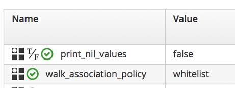
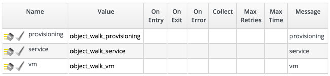
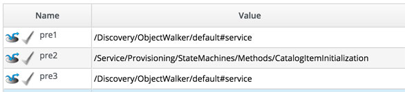

## object_walker

One of the challenges when starting out writing CloudForms or ManageIQ automation scripts, is knowing where the objects and attributes are under $evm.root that we may need to access. For example, depending on the automation action, we may have an $evm.root['vm'] object, or we may not.

This script is an attempt to demystify the object structure that is available at any point in the Automation engine.

Calling the script from any point will walk the object hierarchy from $evm.root downwards, printing objects and attributes
as it goes, i.e.


```
Object Walker 1.6 Starting
     --- $evm.current_* details ---
     $evm.current_namespace = Bit63/Bit63   (type: String)
     $evm.current_class = Methods   (type: String)
     $evm.current_instance = ObjectWalker   (type: String)
     $evm.current_message = create   (type: String)
     $evm.current_object = /Bit63/Bit63/Methods/ObjectWalker   (type: DRb::DRbObject, URI: druby://127.0.0.1:36722)
     $evm.current_object.current_field_name = Execute   (type: String)
     $evm.current_object.current_field_type = method   (type: String)
     $evm.current_method = object_walker   (type: String)
     --- object hierarchy ---
     $evm.root = /ManageIQ/SYSTEM/PROCESS/Request
       $evm.root child = /ManageIQ/System/Request/call_instance
         $evm.parent = /bit63/bit63/methods/test
           $evm.object = /Bit63/Bit63/Methods/ObjectWalker
     --- walking $evm.root ---
     $evm.root = /ManageIQ/SYSTEM/PROCESS/Request   (type: DRb::DRbObject, URI: druby://127.0.0.1:36722)
     |    --- attributes follow ---
     |    $evm.root['ae_provider_category'] = unknown   (type: String)
     |    $evm.root.class = DRb::DRbObject   (type: Class)
     |    $evm.root['ext_management_system'] => vCenter   (type: DRb::DRbObject, URI: druby://127.0.0.1:36722)
     |    |    --- attributes follow ---
     |    |    $evm.root['ext_management_system'].api_version = 4.1   (type: String)
     |    |    $evm.root['ext_management_system'].created_on = 2015-09-23 13:21:18 UTC   (type: ActiveSupport::TimeWithZone)
     |    |    $evm.root['ext_management_system'].guid = f974734e-61f5-11e5-94a1-005056b87ba6   (type: String)
...
     |    |    $evm.root['ext_management_system'].type = EmsVmware   (type: String)
     |    |    $evm.root['ext_management_system'].uid_ems = AB9F17D7-6604-4322-A537-583E23224331   (type: String)
     |    |    $evm.root['ext_management_system'].updated_on = 2015-10-06 14:59:09 UTC   (type: ActiveSupport::TimeWithZone)
     |    |    $evm.root['ext_management_system'].zone_id = 1000000000001   (type: Fixnum)
     |    |    --- end of attributes ---
     |    |    --- virtual columns follow ---
     |    |    $evm.root['ext_management_system'].aggregate_cpu_speed = 6628   (type: Fixnum)
     |    |    $evm.root['ext_management_system'].aggregate_logical_cpus = 2   (type: Fixnum)
     |    |    $evm.root['ext_management_system'].aggregate_memory = 16252   (type: Fixnum)
     |    |    $evm.root['ext_management_system'].aggregate_physical_cpus = 1   (type: Fixnum)
     |    |    $evm.root['ext_management_system'].aggregate_vm_cpus = 21   (type: Fixnum)
     |    |    $evm.root['ext_management_system'].aggregate_vm_memory = 37888   (type: Fixnum)
```
  etc

Many of the objects that we can walk through are in fact Rails Active Record Associations (object representations of database
records), and we often don't want to print all of them. The script has a variable @walk\_association\_policy, that should have
the value of either :whitelist or :blacklist.

if @walk\_association\_policy = :whitelist, then object\_walker will only traverse associations of objects that are explicitly
mentioned in the @walk\_association\_whitelist hash. This enables us to carefully control what is dumped. If object\_walker finds
an association that isn't in the hash, it will print a line similar to:

```
$evm.root['vm'].datacenter (type: Association, objects found)
   (datacenter isn't in the @walk_associations hash for MiqAeServiceVmRedhat...)
```

If you wish to explore and dump this associaiton, edit the hash to add the association name to the list associated with the
object type. The symbol :ALL can be used to walk all associations of an object type

```ruby
@walk_association_whitelist = { "MiqAeServiceServiceTemplateProvisionTask" => ["source", "destination", "miq_request"],
                                "MiqAeServiceServiceTemplate" => ["service_resources"],
                                "MiqAeServiceServiceResource" => ["resource", "service_template"],
                                "MiqAeServiceMiqProvisionRequest" => ["miq_request", "miq_request_tasks"],
                                "MiqAeServiceMiqProvisionRequestTemplate" => ["miq_request", "miq_request_tasks"],
                                "MiqAeServiceMiqProvisionVmware" => ["source", "destination", "miq_provision_request"],
                                "MiqAeServiceMiqProvisionRedhatViaPxe" => [:ALL],
                                "MiqAeServiceVmVmware" => ["ems_cluster", "storage", "service", "hardware"],
                                "MiqAeServiceVmRedhat" => ["ems_cluster", "storage", "service", "hardware"],
                                "MiqAeServiceHardware" => ["nics"]}
```

if @walk\_association\_policy = :blacklist, then object\_walker will traverse all associations of all objects, _except_ those that
are explicitly mentioned in the @walk\_association\_blacklist hash. This enables us to run a more exploratory dump, at the
cost of a **much** more verbose output. The symbol:ALL can be used to prevent the walking any associations of an object type

```ruby
@walk_association_blacklist = { 'MiqAeServiceEmsRedhat' => ['ems_events'],
                                'MiqAeServiceEmsVmware' => ['ems_events'],
                                'MiqAeServiceEmsCluster' => ['all_vms', 'vms', 'ems_events'],
                                'MiqAeServiceHostRedhat' => ['guest_applications', 'ems_events'],
                                'MiqAeServiceHostVmwareEsx' => ['guest_applications', 'ems_events']}
```
The more usual method of running is in :whitelist mode, but this often requires frequent editing of the @walk\_association\_whitelist as new associations are being explored.

To avoid having to edit the source in such circumstances, a service dialog can be created containing a text area box element named _walk\_association\_whitelist_. Any valid whitelist hash entered into this dialog field will be used as a run-time override of the static @walk\_association\_whitelist defined in the code. The ObjectWalker instance can then be called from a button, configured to display the dialog.


Several of the objects in the Automate model have circular references to themselves either directly or indirectly through
other associations. To prevent the same object being dumped multiple times the script records where it's been, and prints:

```
object_walker:   Object MiqAeServiceServiceTemplate with ID 1000000000003 has already been dumped...
```

Many attributes that get dumped have a value of 'nil', i.e.

```
     |    |    $evm.root['user'].userid = admin   (type: String)
     |    |    --- end of attributes ---
     |    |    --- virtual columns follow ---
     |    |    $evm.root['user'].allocated_memory = 0   (type: Fixnum)
     |    |    $evm.root['user'].allocated_storage = 0   (type: Fixnum)
     |    |    $evm.root['user'].allocated_vcpu = 0   (type: Fixnum)
     |    |    $evm.root['user'].custom_1 = nil
     |    |    $evm.root['user'].custom_2 = nil
     |    |    $evm.root['user'].custom_3 = nil
     |    |    $evm.root['user'].custom_4 = nil
     |    |    $evm.root['user'].custom_5 = nil
     |    |    $evm.root['user'].custom_6 = nil
     |    |    $evm.root['user'].custom_7 = nil
     |    |    $evm.root['user'].custom_8 = nil
     |    |    $evm.root['user'].custom_9 = nil
     |    |    $evm.root['user'].ldap_group = EvmGroup-super_administrator   (type: String)
     |    |    $evm.root['user'].miq_group_description = EvmGroup-super_administrator   (type: String)
```

Sometimes we want to know that the attribute is present, even if its value is nil, but at other times we only wish to know
about attributes with valid values (this also gives us a more concise dump output). In this case we can define the script
variable:

```ruby
@print_nil_values = false
```

and the resulting output dump will leave out any keys or attributes that have nil values.

### Installation

Under your own domain, create a new namespace, and a class to execute a single instance.


Here I created an instance called ObjectWalker, and a method called object_walker containing the code.

### Calling object\_walker

We get an object\_walker dump by simply calling the new ObjectWalker instance from anywhere in the automation namespace, e.g.
from a state in the VM Provision State Machine:


... or from a button on a VM:



... or even in-line from some other automation code:

```
$evm.instantiate('/Discovery/Methods/ObjectWalker')
```

### Customising the output

The default @walk\_association\_whitelist dumps quite a lot of information, and it can be useful to tailor this for the particular
type of dump that we are interested in. We can modify our ObjectWalker class to call one of several object\_walker methods, each with
a different @walk\_association\_whitelist, selected using a message when calling the instance. See sample\_whitelists.rb for some examples.




Now we can call the appropriate copy of object\_walker with our customised @walk\_association\_whitelist, for example to compare the
service provision data structures before and after calling CatalogItemInitialization:



(we can use object\_walker\_reader --diff to compare the outputs - see below)

### object\_walker\_reader

Use object\_walker\_reader to extract the latest (no arguments), or a selected object_walker dump from automation.log or other
renamed or saved log file.

```
Usage: object_walker_reader.rb [options]
    -l, --list                       list object_walker dumps in the file
    -f, --file filename              Full file path to automation.log (if not /var/www/miq/vmdb/log/automtion.log)
    -t, --timestamp timestamp        Date/time of the object_walker dump to be listed (hint: copy from -l output)
    -d, --diff timestamp1,timestamp2 Date/time of two object_walker dumps to be compared using 'diff'
    -h, --help                       Displays Help                    Displays Help
```

#### Examples:

##### Listing object\_walker dumps

```
 ./object_walker_reader.rb -l
 Found object_walker dump at 2014-09-17T13:28:42.052043
 Found object_walker dump at 2014-09-17T13:34:52.649359
 Found object_walker dump at 2014-09-17T15:06:29.250086
 Found object_walker dump at 2014-09-17T15:22:46.034628
 Found object_walker dump at 2014-09-18T07:56:08.201025
 ...
```

##### Listing dumps in a non-default (i.e. copied from another system) log file

```
 ./object_walker_reader.rb -l -f /Documents/CloudForms/cf30-automation-log
 Found object_walker dump at 2014-09-18T09:52:28.797868
 Found object_walker dump at 2014-09-18T09:53:31.455892
 Found object_walker dump at 2014-09-18T10:05:39.040744
 Found object_walker dump at 2014-09-18T12:00:59.142460
 ...
```

##### Dumping a particular object\_walker output by timestamp


```
[root@cloudforms05 vmdb]# ~/object_walker_reader.rb -t 2015-10-06T15:53:43.538483
Object Walker 1.6 Starting
     --- $evm.current_* details ---
     $evm.current_namespace = bit63/bit63   (type: String)
     $evm.current_class = methods   (type: String)
     $evm.current_instance = objectwalker   (type: String)
     $evm.current_message = create   (type: String)
     $evm.current_object = /bit63/bit63/methods/objectwalker   (type: DRb::DRbObject, URI: druby://127.0.0.1:47046)
     $evm.current_object.current_field_name = Execute   (type: String)
     $evm.current_object.current_field_type = method   (type: String)
     $evm.current_method = object_walker   (type: String)
     --- object hierarchy ---
     $evm.root = /bit63/bit63/methods/objectwalker
     --- walking $evm.root ---
     $evm.root = /bit63/bit63/methods/objectwalker   (type: DRb::DRbObject, URI: druby://127.0.0.1:47046)
     |    --- attributes follow ---
     |    $evm.root['automation_task'] => #<MiqAeMethodService::MiqAeServiceAutomationTask:0x0000000dbce370>   (type: DRb::DRbObject, URI: druby://127.0.0.1:47046)
     |    |    --- attributes follow ---
     |    |    $evm.root['automation_task'].created_on = 2015-10-06 14:53:41 UTC   (type: ActiveSupport::TimeWithZone)
     |    |    $evm.root['automation_task'].description = Automation Task   (type: String)
```

##### Comparing the output from two object\_walker dumps

```
 ./object_walker_reader.rb -d 2015-05-11T14:41:58.031661,2015-05-11T14:42:08.186930
 Getting diff comparison from dumps at 2015-05-11T14:41:58.031661 and 2015-05-11T14:42:08.186930
 6c6
 <      object_walker:   $evm.current_object = /Bit63/Discovery/ObjectWalker/default   (type: DRb::DRbObject, URI: druby://127.0.0.1:51860)
 ---
 >      object_walker:   $evm.current_object = /Bit63/Discovery/ObjectWalker/default   (type: DRb::DRbObject, URI: druby://127.0.0.1:54749)
 10c10
 <      object_walker:   $evm.root = /Bit63/Service/Provisioning/StateMachines/ServiceProvision_Template/CatalogItemInitialization   (type: DRb::DRbObject, URI: druby://127.0.0.1:51860)
 ---
 >      object_walker:   $evm.root = /Bit63/Service/Provisioning/StateMachines/ServiceProvision_Template/CatalogItemInitialization   (type: DRb::DRbObject, URI: druby://127.0.0.1:54749)
 12c12
 <      object_walker:   $evm.root['ae_state'] = pre1   (type: String)
 ---
 >      object_walker:   $evm.root['ae_state'] = pre3   (type: String)
 14c14
 <      object_walker:   $evm.root['ae_state_started'] = 2015-05-11 14:41:56 UTC   (type: String)
 ---
 >      object_walker:   $evm.root['ae_state_started'] = 2015-05-11 14:42:07 UTC   (type: String)
  ...
```
To use, simple copy the object\_walker\_reader.rb file to the CloudForms appliance (for example to /root), and run.
